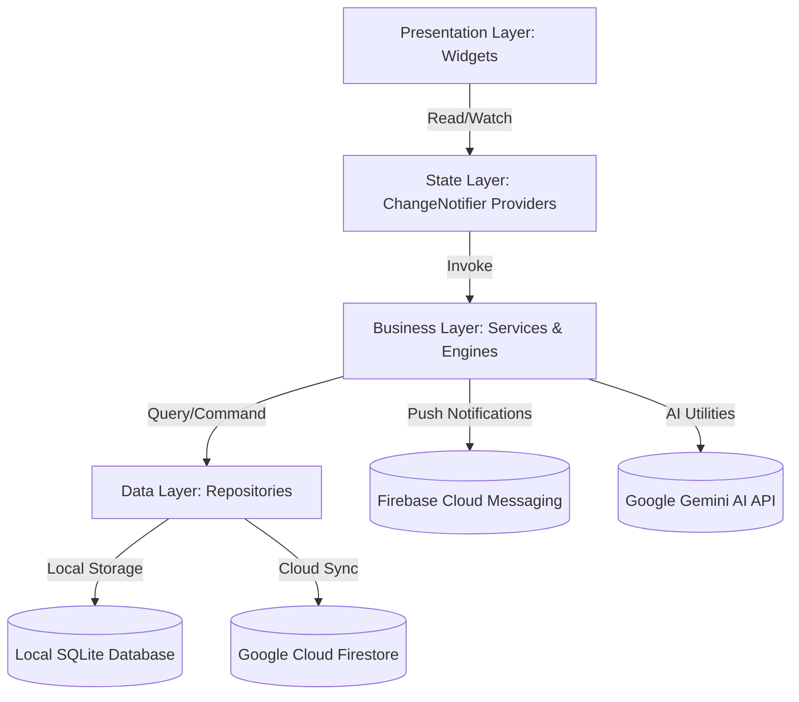
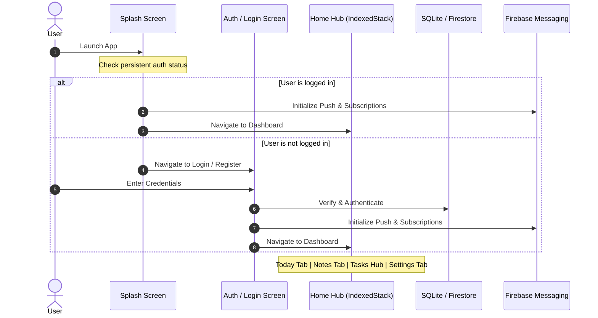

# Reflections — Architecture, App Flow & Feature Specifications

Reflections is a state-of-the-art, **local-first productivity and mindfulness application** inspired by the sleek, minimalist design of "Ritualz". It blends high-performance daily habit tracking, task management, and precise reminder alarms with cloud-synced long-form notes powered by Firebase and Gemini AI.

---

## 1. System Architecture

The application is built on a modular, feature-based **Clean Architecture** combined with **Provider** for reactive state management. The codebase adheres strictly to the separation of concerns, ensuring high stability, easy testing, and maximum performance.

### Layer Separation
1. **Presentation Layer (UI)**: Custom Flutter widgets styled with a unified dual-theme (Deep Dark & Clean Light). Widgets depend entirely on screen sizing ratios provided by `flutter_screenutil` and reactive state from Providers. UI never talks directly to repositories or services.
2. **State Management Layer (Provider)**: Exposes immutable data and reactive methods (e.g., `load()`, `toggle()`, `refresh()`) to the widgets. Standardizes all state handling (Loading, Empty, Success, Error).
3. **Business/Service Layer**: Orchestrates complex workflows, handles file I/O, configures notifications, coordinates Gemini API calls, and aggregates raw data into analytics metrics.
4. **Data/Repository Layer**: Performs low-level data access, manages transaction scopes, executes JSON serialization/deserialization, and ensures schema safety. Uses local **SQLite** for instant response times and offline-first usage, and **Firestore** for real-time note streams.

---

## 2. Dynamic App Flow

### Flow Breakdown
1. **Bootstrapping**: The app starts at the Splash screen, running a 2-second delay. It loads local `.env` settings and initializes the SQLite database schema.
2. **Session Persistence**: If an active Firebase user is found, the app starts `FirebaseMessagingService` to retrieve the device token, subscribes to topic alerts, and forwards the user to the Today Dashboard. Otherwise, they are routed to the Auth screen.
3. **Auth Flow**: Users can sign up or log in. Password hashing and credential checks are handled by Firebase Authentication.
4. **Home Hub Navigation**: Once authenticated, the user enters the Home page, which uses an `IndexedStack` to keep all sub-pages alive. Data loads concurrently across different Provider namespaces using `Future.wait` structures.
5. **Cold Start & Notifications Handling**: If the app was opened via a notification click (even from a fully closed state), `FirebaseMessagingService` intercepts the payload and automatically deep-links the user to the corresponding tab (e.g., Tasks, Habits, Alarms, or external offer URLs).

---

## 3. Core Features

### 📅 Today Dashboard (Daily Overview)
* **Context-Aware Header**: Shows time-dependent greeting (Good Morning/Afternoon/Evening) and current date.
* **Aggregated Stats Card**: Dynamic counts of completed habits (`todayCompletedCount`), todos (`completedCount`), and active daily streak.
* **Horizontal Habit Quick-Tick**: List of today's habits with responsive tap-to-complete animations.
* **Top Tasks**: Lists up to 5 prioritized, non-completed tasks for today.
* **Upcoming Alarms**: Live list of upcoming reminders and precise background alarms.

### 📝 Professional Notes & AI Workspace
* **Real-time Firestore Synchronization**: Automatic offline caching and synchronization. Notes are structured in customizable folders.
* **Gemini AI Integration**:
  * **Title Suggestion**: Recommends a high-quality, 6-word title based on note content.
  * **Proofread & Improve**: Cleans grammar and elevates writing flow instantly.
  * **Voice Polishing**: Cleans up voice dictation transcriptions, fixing homophones and mispronunciations.
* **Mindfulness Features**: Support for note pinning, archiving, dynamic categorization, and full-text keyword search.

### 🎯 Tasks & Habits Hub (The Productivity Center)
Split into 4 focused tabs:
1. **To-Do Page**: Priority level mapping (High, Medium, Low) with visual tag indicators, due date badges, overdue warning filters, and status toggles.
2. **Habit Tracker**:
   - **GitHub-Style Contribution Heatmap**: A custom-drawn grid showing daily habits consistency over the last 6 months with 5 color-density layers.
   - **Streak Engine**: Tracks active and all-time streak records.
   - **Interactive Habit Cards**: Displays weekly progress dots (visual completion array) and lets users easily toggle completions.
3. **Alarm/Reminder Manager**: Schedules precise background and foreground push notifications using `timezone` mapping. Users can customize reminder titles, descriptions, specific trigger times, and toggle high-importance alarm categories.
4. **Activity Analytics**: Provides daily, weekly, and monthly bar graphs powered by `fl_chart`, visual consistency meters, and total completion metrics.

### ⚙️ Settings, Customization & Portability
* **Interactive Profile Workspace**: Allows editing display names and secure account password updates.
* **Dual Theme Customizer**: Ritualz-style Deep Dark mode and Clean Light mode.
* **Multi-Language Support**: Complete translations dynamically loaded between English and Spanish.
* **Dynamic Notifications Subscriptions**: Toggle notifications entirely on/off (automatically handles Firebase Messaging topic subscriptions).
* **Robust Export & Restore Backup**:
  * **Export**: Bundles all local SQLite tables (habits, completions, todos, reminders) and Firestore notes into a single formatted `.json` backup file, shared instantly.
  * **Restore**: Employs `file_picker` to choose a backup file and import data back into SQLite/Firestore with absolute safety, auto-mapping old identifiers and syncing new nodes.
